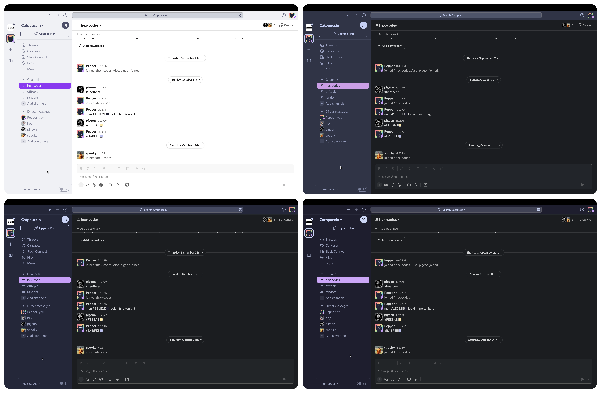

<h3 align="center">
	<br/>
	
	Catppuccin for <a href="https://slack.com">Slack</a>
	
</h3>

<p align="center">
	<a href="https://github.com/catppuccin/slack/stargazers"></a>
	<a href="https://github.com/catppuccin/slack/issues"></a>
	<a href="https://github.com/catppuccin/slack/contributors"></a>
</p>

<p align="center">
	
</p>

## Usage

1. Open Slack Desktop, click your profile picture in the top right.
2. Select **Preferences**.
3. Click **Themes**
4. Below **Colors**, click **Create a custom theme**, and paste your preferred flavour from below

🌻 Latte (Enable light mode in theme settings)

```
#EFF1F5,#F8F8FA,#40A02B,#EFF1F5,#DCE0E8,#4C4F69,#40A02B,#E64553,#EFF1F5,#4C4F69
```

🪴 Frappé

```
#303446,#F8F8FA,#A6D189,#303446,#232634,#C6D0F5,#A6D189,#EA999C,#303446,#C6D0F5
```

🌺 Macchiato

```
#24273A,#F8F8FA,#A6DA95,#24273A,#181926,#CAD3F5,#A6DA95,#EE99A0,#24273A,#CAD3F5
```

🌿 Mocha

```
#1E1E2E,#F8F8FA,#A6E3A1,#1E1E2E,#11111B,#CDD6F4,#A6E3A1,#EBA0AC,#1E1E2E,#CDD6F4
```

## 💝 Thanks to

- [uShldGetCeleste](https://github.com/uShldGetCeleste)

&nbsp;

<p align="center">
	
</p>

<p align="center">
	Copyright &copy; 2021-present <a href="https://github.com/catppuccin" target="_blank">Catppuccin Org</a>
</p>

<p align="center">
	<a href="https://github.com/catppuccin/catppuccin/blob/main/LICENSE"></a>
</p>
